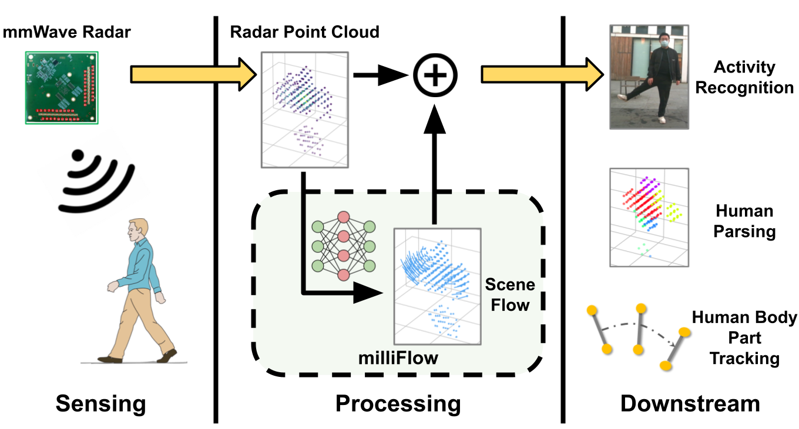

<div align="center">   
 
# milliFlow: Scene Flow Estimation on mmWave Radar Point Cloud for Human Motion Sensing
</div>

[](https://arxiv.org/abs/2306.17010) 
[](https://www.youtube.com/watch?v=fa91EeueGHA)
[](https://creativecommons.org/licenses/by-nc/4.0/)

<p align="left">

</p>

This work presents **milliFlow**, a scene flow estimation module to provide an additional layer of **point-wise motion information** on top of the original mmWave radar point cloud in the conventional mmWave-based **human motion sensing** pipeline. For technical details, please refer to our paper on ECCV 2024:

**milliFlow: Scene Flow Estimation on mmWave Radar Point Cloud for Human Motion Sensing**
<br/>
[Fangqiang Ding](https://toytiny.github.io/), [Zhen Luo](https://www.researchgate.net/profile/Zhen-Luo-32), [Peijun Zhao](https://scholar.google.com/citations?user=et397zMAAAAJ&hl=en), [Chris Xiaoxuan Lu](https://christopherlu.github.io/)
<br/>
[[arXiv]](https://arxiv.org/pdf/2306.17010) [[video]](https://youtu.be/fa91EeueGHA) [[poster]](./src/poster_eccv24_milliFlow.pdf) 


## 🔥 News
 - [2024-03-15] Our preprint paper is available on 👉[arXiv](https://arxiv.org/pdf/2306.17010).
 - [2024-07-01] Our paper is accepted by 🎉[ECCV 2024](https://eccv2024.ecva.net/).
 - [2024-09-12] Our presentation video and poster is online. Please check them out 👉[video](https://youtu.be/fa91EeueGHA) | [poster](./src/poster_eccv24_milliFlow.pdf) 

## 📝 Abstract
Human motion sensing plays a crucial role in smart systems
for decision-making, user interaction, and personalized services. Extensive research that has been conducted is predominantly based on cameras, whose intrusive nature limits their use in smart home applications.
To address this, mmWave radars have gained popularity due to their
privacy-friendly features. In this work, we propose milliFlow, a novel
deep learning approach to estimate scene flow as complementary motion information for mmWave point cloud, serving as an intermediate
level of features and directly benefiting downstream human motion sensing tasks. Experimental results demonstrate the superior performance of
our method when compared with the competing approaches. Furthermore, by incorporating scene flow information, we achieve remarkable
improvements in human activity recognition and human parsing and
support human body part tracking. 

## 📊 Data
You can download the dataset [here](https://drive.google.com/file/d/19U-tXv505CvnaQ0EFR8ZqH-TatEiHe8P/view?usp=sharing).

## 🚀 Getting Started
To find out how to run our scodes, please see our intructions in GETTING_STARTED, which will be made by the end of October. Stay tuned for update! 
   
## 🔗 Citation
When using the code, model, or dataset, please cite the following paper:


```shell
@InProceedings{Ding_2024_ECCV,
    author    = {Ding, Fangqiang and Luo, Zhen and Zhao, Peijun and Lu, Chris Xiaoxuan},
    title     = {milliFlow: Scene Flow Estimation on mmWave Radar Point Cloud for Human Motion Sensing},
    booktitle = {Proceedings of the European Conference on Computer Vision  (ECCV)},
    year      = {2024},
    pages     = {202-221},
    organization = {Springer}
}
```

## 📄 License

### Code and Model License

The code and model provided in this repository are licensed under the Creative Commons Attribution-NonCommercial 4.0 International License (CC BY-NC 4.0). See the [LICENSE](LICENSE) file for details.


### Dataset License

The dataset provided in this repository is licensed under the Creative Commons Attribution-NonCommercial 4.0 International License (CC BY-NC 4.0). See the [LICENSE](LICENSE) file for details.


